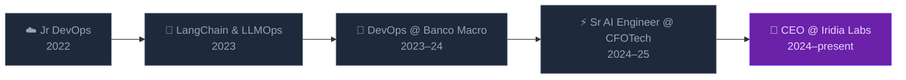

# Lautaro Vallejos

**CEO & Co-Founder @ [Iridia Labs](https://github.com/iridia-ai) · Sr AI Engineer**

Creating world-class Gen AI systems that seem like black magic from Buenos Aires

---

## Sobre mí

Arranqué en tech a los 17 como Jr DevOps. A los 20 ya había desplegado infraestructura de producción en Banco Macro (uno de los bancos más grandes de Argentina), construido productos con LLMs en Notimation, y liderado proyectos de IA Generativa en CFOTech — documentadores de código COBOL, generadores de reportes de RRHH, automatización de QA. Todo mientras fundaba [Iridia Labs](https://iridia-labs.com).

Ese camino me dejó tres convicciones sobre las que está construida Iridia:

- **Claridad antes de código** — Si el problema no está bien entendido, ninguna solución sobrevive el contacto con la realidad.
- **Validar temprano** — Es mejor estar equivocado en la semana 2 que en el mes 6, ya en producción.
- **Shipper productos reales** — Nada de PowerPoints ni pilotos que nunca escalan. Código que corre en el mundo real.

> *"Cualquier tecnología suficientemente avanzada es indistinguible de la magia." — Arthur C. Clarke*

---

## Qué construimos en Iridia Labs

Iridia Labs es un laboratorio de producto diseñado para cerrar la brecha entre el prototipo y producción. Fusionamos **Gen AI**, **DevOps** e **Ingeniería de Software** para construir sistemas que no solo sobreviven en el mundo real — parecen magia.

| Qué | Cómo |
|-----|------|
| Agentes de AI | Asistentes autónomos que no solo responden — ejecutan acciones |
| Sistemas RAG | El conocimiento empresarial, siempre accesible en lenguaje natural |
| Text-to-SQL | Inteligencia de negocio sin necesitar saber SQL |
| Agentes de Voz | Llamadas telefónicas manejadas a escala, como lo haría un humano |
| Extracción de Documentos | Facturas, contratos, formularios → datos estructurados, automáticamente |
| Plataformas Agénticas | De la idea a producción en 2–12 semanas |

Trabajamos con empresas de software en 7 países. Nuestro objetivo: meter a nuestros clientes en el **5% de los proyectos de IA que realmente funcionan y generan ROI real**.

---

## Tech & Herramientas

**AI & LLMs**

**Cloud & DevOps**

**Frontend**

---

## Trayectoria

---

## Cómo pienso

- Los mejores sistemas de IA no reemplazan humanos — los amplifican.
- La profundidad técnica no es el objetivo, es la limitación que hace posible el objetivo.
- El 95% de los proyectos de IA fracasan no por la tecnología, sino por falta de visión, supuestos no validados y cero testing en el mundo real.
- La iteración le gana a la perfección. Siempre.

---

  Construyendo desde Buenos Aires. Shippeando al mundo.

